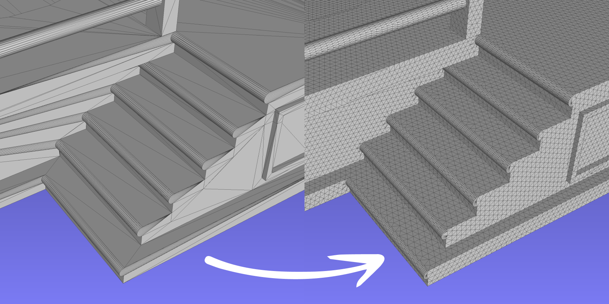
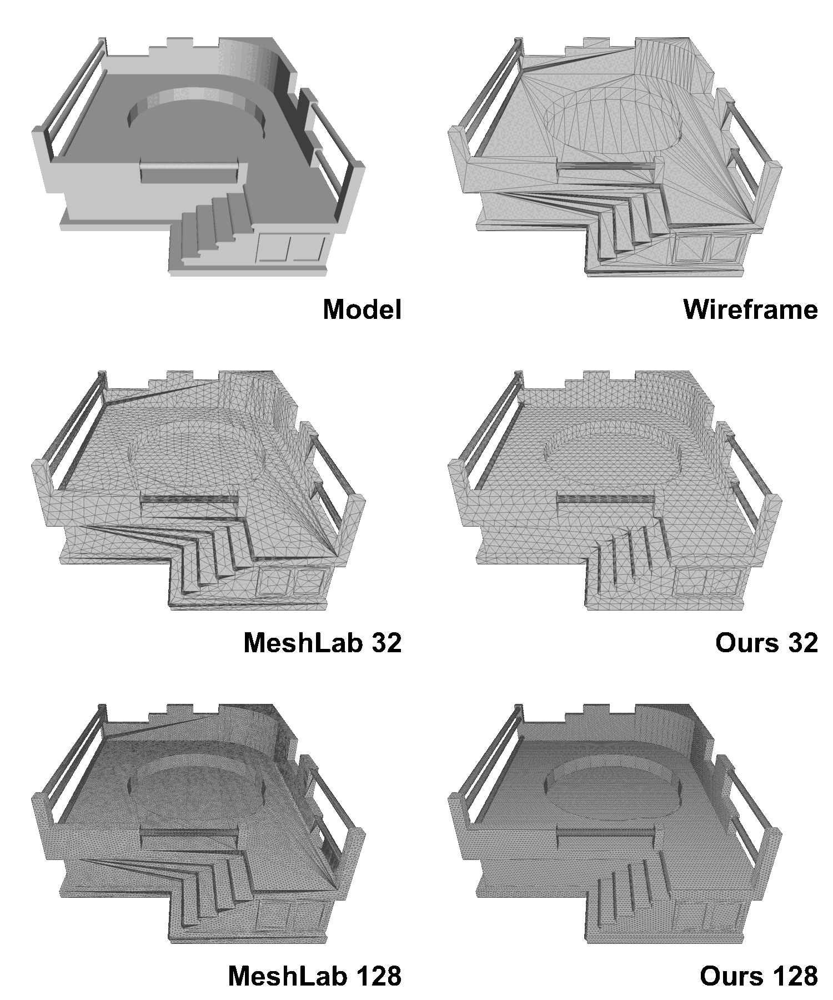

# Planar Isotropic Remesher

This code implements isotropic remeshing 3D meshes with planarity constraints revisited.



## What is it for?

**Remeshing** is a process that takes in a 3D mesh and produces a similar-looking mesh with a different number of faces and vertices while keeping some constraints. Such constraints include **planarity** and **isotropicity**.
This project implements remeshing with a fast approximation of these constraints while guaranteeing the output mesh's geometrical consistency with the input.

**Isotropic constraint** requires the output mesh to have a maximum edge length (face diameter) at most of a given value and vertices to be spread out in space in all directions on the object's surface as far from each other as possible.
This constraint is tough to enforce around model edges, so most degradation happens around the model's edges with this constraint enforced.

**Planarity constraint** requires the output mesh to keep edges intact. It operates on top of the isotropic constraint.

Most 3D processing tools already provide isotropic remeshing with planarity constraints. However, enforcing isotropy
is a complex iterative process, and the result is not always guaranteed to be correct. Whenever there is a need for
**approximate isotropic constraint**, this code can deliver results much faster and more reliably than previous
approaches. All model edges are preserved, but some intermediate edges are allowed to be
much shorter than the selected diameter. See the [Gallery](#gallery) for examples of different methods' outputs.

## Usage

### Building

Ensure that the dependencies are installed:
- [CMake](https://cmake.org/) build system and a C++17 toolchain
- [CGAL](https://www.cgal.org/) 3D processing library
- [Eigen](https://eigen.tuxfamily.org/index.php?title=Main_Page) matrix computation library
- [Boost](https://www.boost.org/) C++ extensions library

Then build as follows:

```shell
cmake -B build -DCMAKE_BUILD_TYPE=Release
cmake --build build -j
```

### Running

The code accepts and produces files in the Object File Format (`*.off`) file format. 
Test the code as follows:

```shell
./build/remesh_isotropic_planar data/jacuzzi.off out.off --resolution 128 
```

Resolution defines the length of the output model's edges relative to the whole model's diameter.
In this case, the maximum edge length will be 1/128 of the model size.
Higher values produce more faces and vertices.

## Gallery

The first row shows the sample model that undergoes remeshing and its wireframe.
We show two methods, MeshLab and ours, in two resolutions of 32 and 128, respectively.
For MeshLab, we used the Isotropic Explicit Remeshing filter with 10 iterations, adaptive remeshing, crease angle of 0.01, and other default options.
As the animation shows, our method produces more homogeneous results and does not introduce artifacts.



## License and Citation

Copyright (c) 2023, Anton Obukhov.

The code is provided under GPL-3.0-or-later, refer to [LICENSE](LICENSE) for complete terms.

